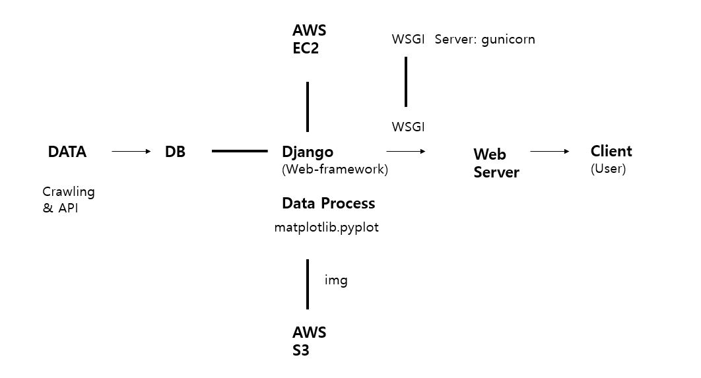

<a href="../README.md">Home</a>
# Description

## Architecture

## Can volatility affect the interest rate of bond?
The graph can divide 4 terms and each term's trend is same.
I try to find the volatility of each term can affect the yield.
It means that volatility goes up, the risk of market increasing and yield goes up.
So I calculates the figures of each term.

1. average of yield
> The average of yield data. 
> It can be more useful if standard deviation of yield is smaller.  
2. standard deviation of yield

3. volatility
> I select historical volatility.
> The reference about the volatility is [here](https://www.investopedia.com/terms/v/volatility.asp).
4. average of differentiation
> The differentiation is 
δy/δt.
> The average of differentiation is useful when the trend of graph is unidirectional

First I checked South Korea treasury bond yield data
Term3 and term4 are group of lager amount of volatility.
In this case, if my hypothesis is correct, the standard deviation of the rate of return for both terms should be large, 
and the average differentiation should be positive.
But I found an outlier in term3. In term3, the standard deviation of the rate of return was the smallest, 
and the average differentiation showed a negative value.
These figures were the same from AAA to BBB-.
On the conclusion, it has been found that volatility does not always increase returns in the bond market.

In the thesis of The Asymmetric Spillovers in Return and Volatility between Korean Stock and Bond Market, Choi, Wan-Soo(2020),
The volatility of the stock market is reflected in the stock market return as a risk premium, but in the case of the bond market,
its own volatility is not reflected in the bond market return.
In addition, according to the volatility spillover effect, 
the volatility of the stock market is reflected in the yield on the bond market, but the reverse is not established.
In the case of the government bond market, unlike the stock market, it is a market centered on institutional investors.
Market participants are relatively limited compared to the stock market, 
and investment patterns are also less efficient than the stock market due to their high tendency to hold them until maturity.
This is the cause of the unilateral volatility spillover effect from the stock market to the bond market.
