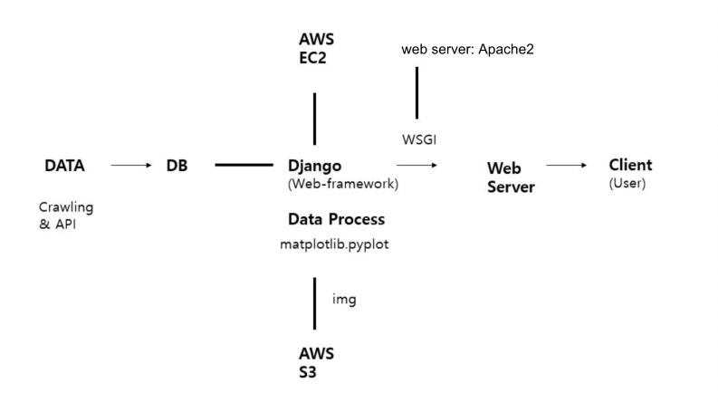

<a href="../README.md">Home</a>
# Description

## 1. Architecture


## 2. Can volatility affect the interest rate of bond?

### 2-1. Process
In application, graphs can divide four different periods of the same trend.


In general, volatility in stocks is converted into a risk premium and reflected in the return on stocks. 
In other words, as volatility increases, the risk premium also increases, which affects the direction in which the return on stocks rises.
Whether this same concept applies to the bond market is confirmed through the relationship between the volatility of the five-year bond yield and the bond yield.
The following figures were used to find the relationship.

1. average of yield
> The average of yield data. 
> It can be more useful if standard deviation of yield is smaller.  
2. standard deviation of yield
> The standard deviation is a number that shows how far it deviates from the mean. 
> It is an indicator of the risk of bond yields.
3. volatility
> Historical volatility.
> The reference about the volatility is [here](https://www.investopedia.com/terms/v/volatility.asp).
4. average of differentiation
> It is the same as average rate of change.\
> The differentiation is 
δy/δt.\
> The average of differentiation is useful when the trend of graph is unidirectional

### 2-2. Result


Term3 and term4 are group of lager amount of volatility.
In this case, the standard deviation of the rate of return for both terms should be large, 
and the average differentiation should be positive.
In term3, the standard deviation of the rate of return was the smallest, 
and the average differentiation showed a negative value.
These figures were the same from AAA to BBB-.
On the conclusion, it has been found that volatility does not always increase return on the bond market.

In the thesis of The Asymmetric Spillovers in Return and Volatility between Korean Stock and Bond Market, Choi, Wan-Soo(2020),
The volatility of the stock market is reflected in the stock market return as a risk premium, but in the case of the bond market,
its own volatility is not reflected in the bond market return. 

In the case of the government bond market, unlike the stock market, it is a market centered on institutional investors.
Market participants are relatively limited compared to the stock market, 
and investment patterns are also less efficient than the stock market due to their high tendency to hold them until maturity.
This is the cause of the unilateral volatility spillover effect from the stock market to the bond market.

### 2-3. Further research
To prove that comparing the relation between bond volatility and the average rate of change, 
measuring the correlation coefficient between stock price volatility and the average rate of change should be preceded and compared with bond data.

To derive the correlation coefficient, the volatility and the number of samples of average differentiation must be greater than 25. 
Therefore, the period from 2016 to 2021 was divided into 30.
The results are as follows.

* Correlation analysis between stock ROI volatility and average differentiation

```
<Rstudio>

Pearson's product-moment correlation

data:  stk_dt$volatility and stk_dt$avg_diff
t = -1.9093, df = 28, p-value = 0.06651
alternative hypothesis: true correlation is not equal to 0
95 percent confidence interval:
-0.62344621  0.02376323
sample estimates:
cor
-0.3394117
```

The p-value of the correlation coefficient estimated to be 95% confidence level is 0.06651. 
This result may be considered that the significance of the correlation coefficient is low because the p-value is greater than 0.05.

However, furthermore, the correlation analysis was conducted on the Korean treasure bond.

* Correlation analysis between treasury bond volatility and average differentiation

```
<Rstudio>

Pearson's product-moment correlation

data:  bnd_dt$volatility and bnd_dt$avg_diff
t = 0.58064, df = 28, p-value = 0.5661
alternative hypothesis: true correlation is not equal to 0
95 percent confidence interval:
 -0.2614674  0.4515994
sample estimates:
      cor 
0.1090767 
```

The p-value of bond data correlation is 0.5661. It is definitely denied compared with stock data.
The reason of inappropriate p-value in stock data is derived from the size of data which is n=30.
So It should be more fitted if the size of data is adequate.

For those reasons, if the relation of volatility and average differentiation of stock ROI is proved,
it is possible access to analyse the relation of bond data.
However, the correlation between volatility and average differentiation of treasury bond is not in the confidence interval.
So the hypothesis(H1) "volatility can affect the interest rate of bond" is denied.


<b>> More Information</b>

<details><summary style="font-size: 14px;font-weight:bold;">The code of correlation figure</summary>

```python
# /storage.py

df = stock.get_index_ohlcv_by_date("20161129", "20211126", "1001")
bond_obj = _get_obj('국고채')
terms = div_term(len(df), term_num=30)

stk_avg_diff = []
stk_volatility = []
bnd_avg_diff = []
bnd_volatility = []
for i, tr in enumerate(terms):
    obj_by_term = []
    for t in tr:
        obj_by_term.append(bond_obj[t])
    bnd_avg_diff.append(round(snd_avg_dff(obj_by_term), 5))
    bnd_volatility.append(round(snd_vol(obj_by_term), 5))

    obj = df.copy().iloc[tr]
    obj['수익률'] = obj['종가'] / obj.iloc[0]['종가']
    yield_list = []
    for o in obj['수익률']:
        yield_list.append(o)
    idx=1
    dy_arr = []
    while(idx<len(yield_list)):
        dy = np.log(yield_list[idx]/yield_list[idx-1])
        dy_arr.append(dy)
        idx += 1
    value =  sum(dy_arr)/len(dy_arr)
    stk_avg_diff.append(round(value, 5))

    avg_dy = sum(dy_arr)/len(yield_list)
    dvy_arr = list(map(lambda x: (avg_dy-x)**2, dy_arr))
    value = math.sqrt((sum(dvy_arr)/len(dvy_arr))*252)
    stk_volatility.append(round(value, 5))

df = pd.DataFrame([stk_volatility, stk_avg_diff]).transpose()
df.columns = ['volatility', 'avg_diff']
print('The correlation of KOSPI volatility and average differentiation')
print(df.corr())
print('-----------------------------')

print('The correlation of South Korea Treasury bond volatility and average differentiation')
df = pd.DataFrame([bnd_volatility, bnd_avg_diff]).transpose()
df.columns = ['volatility', 'avg_diff']
print(df.corr())
print('-----------------------------')
```
</details>
